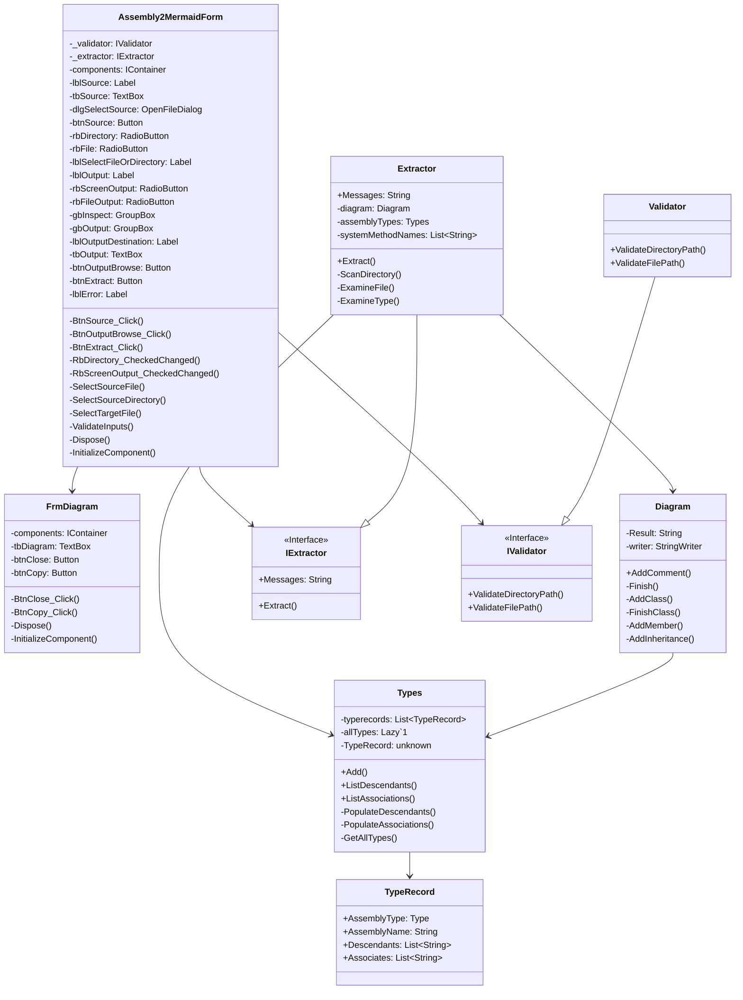


-----------------------------------------------

```mermaid
classDiagram
    class Assembly2MermaidForm {
        -BtnSource_Click()
        -BtnOutputBrowse_Click()
        -BtnExtract_Click()
        -RbDirectory_CheckedChanged()
        -RbScreenOutput_CheckedChanged()
        -SelectSourceFile()
        -SelectSourceDirectory()
        -SelectTargetFile()
        -ValidateInputs()
        -Dispose()
        -InitializeComponent()
        -_validator: IValidator
        -_extractor: IExtractor
        -components: IContainer
        -lblSource: Label
        -tbSource: TextBox
        -dlgSelectSource: OpenFileDialog
        -btnSource: Button
        -rbDirectory: RadioButton
        -rbFile: RadioButton
        -lblSelectFileOrDirectory: Label
        -lblOutput: Label
        -rbScreenOutput: RadioButton
        -rbFileOutput: RadioButton
        -gbInspect: GroupBox
        -gbOutput: GroupBox
        -lblOutputDestination: Label
        -tbOutput: TextBox
        -btnOutputBrowse: Button
        -btnExtract: Button
        -lblError: Label
    }

    class FrmDiagram {
        -BtnClose_Click()
        -BtnCopy_Click()
        -Dispose()
        -InitializeComponent()
        -components: IContainer
        -tbDiagram: TextBox
        -btnClose: Button
        -btnCopy: Button
    }

    class Diagram {
        +AddComment()
        -Finish()
        -AddClass()
        -FinishClass()
        -AddMember()
        -AddInheritance()
        -Result: String
        -writer: StringWriter
    }

    class Extractor {
        +Extract()
        +Messages: String
        -ScanDirectory()
        -ExamineFile()
        -ExamineType()
        -diagram: Diagram
        -assemblyTypes: Types
        -systemMethodNames: List~String~
    }

    class IExtractor {
        <<Interface>>
        +Extract()
        +Messages: String
    }

    class IValidator {
        <<Interface>>
        +ValidateDirectoryPath()
        +ValidateFilePath()
    }

    class Types {
        +Add()
        +ListDescendants()
        +ListAssociations()
        -PopulateDescendants()
        -PopulateAssociations()
        -GetAllTypes()
        -typerecords: List~TypeRecord~
        -allTypes: Lazy`1
        -TypeRecord: unknown
    }

    class Validator {
        +ValidateDirectoryPath()
        +ValidateFilePath()
    }

    class TypeRecord {
        +AssemblyType: Type
        +AssemblyName: String
        +Descendants: List~String~
        +Associates: List~String~
    }


    Extractor --|> IExtractor
    Validator --|> IValidator
    Assembly2MermaidForm --> IValidator
    Assembly2MermaidForm --> IExtractor
    Assembly2MermaidForm --> FrmDiagram
    Diagram --> Types
    Extractor --> Diagram
    Extractor --> Types
    Types --> TypeRecord

```

-----------------------------------------------

